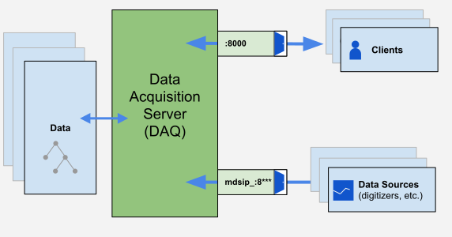

# Experiment Configuration/Data Acquisition Cycle


[diagram of data flow from digitizers to the daq server]

* actions/dispatching
  * phase_table
* building/using devices (link)
* cleaning/archiving shots each night
* static mdsip services (dispatch, analysis, daqXX, etc)
  * logging
* creating a shot database ?

## Static `mdsip` services
For various purposes you might want to set up `mdsip` services and have them ready to go. (assumption here is that we've explained why you want to do this elsewhere. ) 
> TODO: write down why you would want to do this ... elsewhere

Some examples of why you would want this:
* Running devices
* Running codes (analysis, post process, etc., basically the science, and also submitting jobs such as to a supercomputing cluster)
* To provide access to trees without worry of running out of sockets, effectively giving priority access (an `mdsip` service will begin on startup, and other services can then go through `:8000` which is a "technically" finite resource)

Here's an example service file. The way you should do this is with `systemd` (there's also an old way to do this called `initd`, but we won't talk about it). The idea is that you create a service file and what it does is describes to the system how to run (`Service` section in below example) and maintain a service (`Restart=always` in example below), plus when to run it (`install` section in the below example). 

> TODO: Decide if we want to talk about `/etc/services` (named ports)  
  alcdaq6:mdsip_analysis //example named port, which is confusing  
  alcdaq6:8001  // this is a more obvious host:port combo which everyone will recognize

`/etc/systemd/system/mdsip_xyz.service`
```
[Unit]
Description=mdsip service for XYZ

[Service]
# Trigger debug logging from pydevices
Environment=DEBUG_DEVICES=5
# Prevent pydevice logs from being truncated during a crash
Environment=PYTHONUNBUFFERED=1
ExecStart=/usr/local/mdsplus/bin/mdsipd -p 8123 .....    #this is the program to run plus the port ("-p 8123") to run it on
Restart=always

[Install]
WantedBy=multi-user.target
```
Here are some example services and port numbers. The numbers are arbitrary, but should be organized, so choose them wisely.
(but once assigned it will be exclusively assigned (fix this wording later))
```
8001 mdsip_analysis
8002 mdsip_dispatch
8003 mdsip_monitor ?
# Assign the mdsip_daqXX services as 8100 + XX for easy reference
8101 mdsip_daq01
8102 mdsip_daq02
...
```

> TODO: Requires=path-to-trees.mount or whatever it's called


## Dispatch Table
TODO: More to come

The dispatcher serves as the state machine of MDSplus. Use the function `phase_table()` to list the states in your experiment.
* it comes with defaults
* TODO: get more from Stephen/Fernando

There are basically two ways to think of state machines:
1. run this code when you enter this state

    simpler, cheaper, easier, but limited

2. run this code when you transition between two states

    e.g., `abort to init` is very different from `success to init`, so there are decision trees that have to be written that cover every possible transition you expect.
    
It's actually not possible to switch between types. Dispatcher was programmed as a #1, but there are various TCL scripts to make it behave like a #2 one. Eventually the current dispatcher will be rewritten completely to be a #2 type. CMOD had a type 2 built on top of it to handle the various contingencies, but this is inefficient. If you were designing an experiment today, it's a good idea to set up a state machine.

**Building a dispatch table**

A dispatch table makes things run in a specific order. The algorithm can be described as such:

1. find all the action nodes in order (top to bottom)

2. filter out the ones not in the current phase

3. order them by priority (1 to 100. default is 50. If everything is set to 50, it goes by order of NID or Node ID or internal number. If the model doesn't change at all, all shots will go in the same order. If we make a new dispatcher, many of these characteristics would carry over)

4. save that table. this is called the dispatch table. The dispatch table is built fresh for every new shot since parameters may change from one shot to the next depending on the experiment. This is not automatic, there's a command that needs to be run.


> How does the dispatcher know what the current phase is? Is it listening for a specific "Event" that happens?