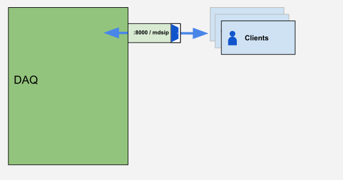
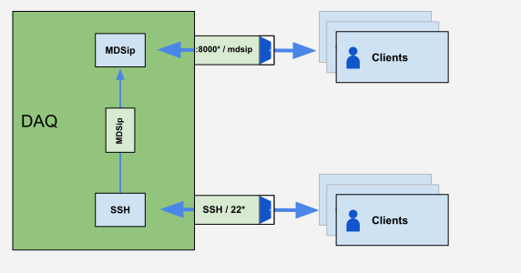

# Configure Access

## `mdsip.hosts`

`mdsip` is the name of the MDSplus service. The `mdsip.hosts` file  defines how to map users for incoming connections. It can also be used to control access for specific user groups. (TODO: More to come...apparently it only sort of but not really does this). NOTE: if you want some authorization, use SSH, which is described elsewhere [TODO: link].

When calling `mdsip` you must specify a `mdsip.hosts` file with `-h`; for example: 
```
mdsip -c 0 -p 8123 -h /etc/mdsip.hosts
```
### Language, Syntax, and Formatting Rules
The `mdsip.hosts` file follows the language/formatting rules below:
* `#` indicates a comment and the rest of the line will be ignored; must be placed at the beginning of the line
* `|` separates two halves (TODO: Come back to this)
  * left is address wildcard
  * right is the mapping information
* `!` at the beginning of a line denies access. Examples:
  * `! slwalsh@*` block the user `slwalsh` from anywhere
  * `! *@192.168.10.42` block every user from `192.168.10.42`
  * Note: `! 192.168.10.42` does **NOT** block users from that IP. Please pay attention to the syntax.
  * Note: When using the `!` anything after the `|` divider is ignored.
* The file is checked top to bottom and the first line that succeeds will finish the process
* additional whitespace is ignored

TODO: Stephen to investigate `-h TDImyaccessfunction`
See also: systemd/xinetd under [On Demand mdsip](on-demand-mdsip).


### Examples
The following examples are solutions to specific problems and may be combined as needed. 

#### Read-only
This maps all users to a read-only account.

```
* | nobody 
```


#### Normal Configuration
This can be considered the basic normal configuration.
* the first line accepts connections from anywhere and attempts to map the username specified to a user on the system. if it fails, it will go to the next line. 
* the second line accepts connections from anywhere and maps to them to a read-only user 

```
* | MAP_TO_LOCAL
* | nobody 
```


#### Controlling user mapping based on incoming subnet

In the following example, we have 2 networks: 
* `192.168.10.0/24` is for computers accessing data. 
  * Users coming from here will be mapped to their accounts, with their privileges.
* `192.168.20.0/24` is for devices capturing and storing data. 
  * Any incoming connections will be mapped to the `daq_user` service account, which for the purposes of this example, would be an account set up with privileges to write data.

```
*@192.168.10.* | MAP_TO_LOCAL 
*@192.168.20.* | daq_user
```


#### Controlling user mapping based on incoming subnet, not octet-aligned

This example is the same as above, however, the networks do not align to an octet boundary. Currently, MDSplus does not understand CIDR (or even netmask) subnetting, so wildcards must be used.

In this example, our two networks are:
* `172.16.4.0/22`
* `172.16.8.0/22`

```
*@172.16.4.*  | MAP_TO_LOCAL 
*@172.16.5.*  | MAP_TO_LOCAL 
*@172.16.6.*  | MAP_TO_LOCAL 
*@172.16.7.*  | MAP_TO_LOCAL 
*@172.16.8.*  | daq_user
*@172.16.9.*  | daq_user
*@172.16.10.* | daq_user
*@172.16.11.* | daq_user
```

#### Allowing a specific user from a specific host

```
# allow John Doe from his workstation
jdoe@192.168.42.123 | MAP_TO_LOCAL
```

#### Using a Domain Name
TODO: intro text
```
*@example.com | MAP_TO_LOCAL
```


#### MULTI
TODO: more to come
```
MULTI | username
```

#### JAVA_USER
jScope unfortunately does not use your user credentials when connecting to mdsip servers. Instead, it uses the reserved username `JAVA_USER`. This can be overwritten by the command line, however, to allow users of jScope to access your data. It can be useful to add a line for `JAVA_USER` to `mdsip.hosts` 


#### Fusion Grid
TODO


## Firewall
TODO: Stephen

## Tree Access

The administrator will need to determine what access methods are allowed (thin, local, thick/dist, ssh) and what access methods are automatically configured ($TREE_path / $default_tree_path)
TODO: crosslinks to Thin, Local/thick/distributed

Examples:
* `/path/to/trees` (local)
* `server::` (thick)
* `server::/path/to/trees` (distributed) 
> TODO: more to come from Stephen



*Diagram of clients accessing data*


## mdsip over SSH
TODO: more to come from Stephen


*Diagram of clients accessing data through the :8000 port as well as as over SSH*
TODO: different/new diagram showing sshp://


### Thin
TODO: more to come; steal from MDSplus documentation

```
mdsconnect('ssh://user@server')
mdsconnect('sshp://user@server')
```


There are two methods of SSH supported, `ssh://` and `sshp://`.

#### `ssh://` - Connect using `mdsip-server-ssh`

Using this protocol will attempt to spawn `/bin/sh -l -c mdsip-server-ssh` on the remote server, and then use that as the MDSip server.

**Note:** This will fail if you do not source the MDSplus `setup.sh` on login, or if it cannot find `mdsip-server-ssh` on the `$PATH`.

TODO: Stephen to verify that all these commands work

```py
# This will run `ssh server "/bin/sh -l -c mdsip-server-ssh"`
c = MDSplus.Connection('ssh://server')

# Specify a custom username for MDSplus and SSH
c = MDSplus.Connection('ssh://username@server')

# Specify a custom port for MDSip
c = MDSplus.Connection('ssh://server:2222')
```

TODO: Stephen to provide examples for multiple languages


#### `sshp://` - Connect using `nc $sshp_host $port`

Using this protocol will attempt to spawn `ssh $host -p $ssh_port` and then `nc $sshp_host $port` on the remote server, and then use that to proxy to the MDSip server. Note: this requires netcat (nc) to be installed.

```py
# This will run `ssh server "nc localhost 8000"`
c = MDSplus.Connection('sshp://server')

# Specify a custom username for MDSplus and SSH
c = MDSplus.Connection('sshp://username@server')

# Specify a custom port for MDSip
# This will run `ssh server "nc localhost 8123"`
c = MDSplus.Connection('sshp://server:8123')
```


### Thick/Distributed
TODO: more to come

```
TREE_path=ssh://user@server
TREE_path=sshp://user@server
```
