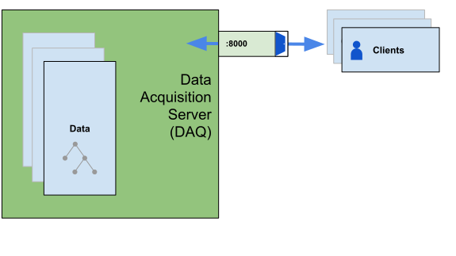
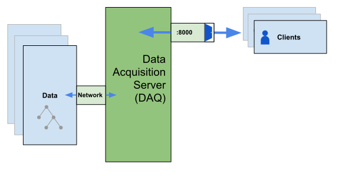
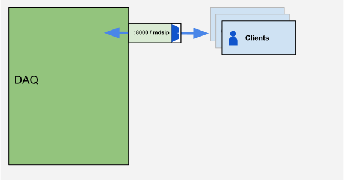
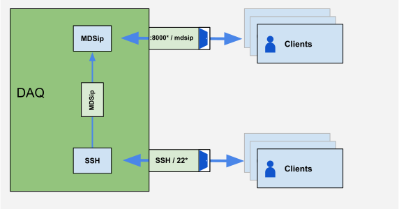
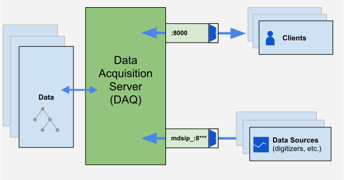

# Setting up a Data Acquisition (DAQ) Server

## Overview

A data acquisition (DAQ) server stores the data you generate from your experiments and provides data and calculations when queried. A DAQ server can also run the software that acquires the data. MDSplus provides a high degree of flexibility for setting up a DAQ server, offering a modular structure that can be customized for any experimental design. Creating a DAQ server will require you as the administrator to make a series of decisions; the goal of this document is to help those be informed decisions. It is recommended that you read this guide before purchasing the hardware necessary for your setup.

## 0. Install MDSplus

Begin by installing MDSplus on your server. Follow the instructions for your operating system [on this page](install.md).


## 1. Configure Your Trees

* Designing your trees
  * raw/processed
* Storing your trees
  * new/archive

### Designing Your Trees: Subtrees

One major decision you will be making is whether and how to include subtrees in the design of your data trees. Ultimately, subtrees matter most when scaling up an experiment&mdash;as the experiment grows, you may want to restrict access of specific areas to certain groups. In a small experiment with no plans for expansion, there is no need to worry about this. However, if you are setting up an experiment with any growth potential you need to set up any subtrees from the beginning&mdash;it will not be easy to move a portion of your tree to a new subtree, as there are no/few tools to help you do so; additionally, it takes significant effort to go back and reorganize data trees later because you will have to retroactively make subtrees and carefully move the data into them.

| Pros | Cons |
|------|------|
| Subtrees can be opened independently, which speeds up opening time if you only need specific sections. | Duplicates/multiplies storage needs. It also takes longer to open everything when you open the head node.  |
| Subtrees allow for restricted access by tree (e.g. grant someone write-access to just their specific diagnostic) | &nbsp; |

```
add node SUBTREE /usage=subtree
```

### Raw/Processed Data

It is highly recommended that archived data consist of two trees:
* The **raw data** tree should contain all data and device information captured during the experiment. When the shot gets archived, the raw data tree can be marked as `immutable` (`chattr + i`) to prevent it from being acidentally overwritten. 

* The **processed data** tree can contain everything else&mdash;equations, calculated values (e.g., IP), data computed from an analysis script, alias nodes for different digitizer channels (e.g., nickname for a specific temperature probe). The processed data tree can grow as more people run analyses and add to the computed values.

Raw data trees usually exist as subtrees within the processed data trees, allowing the processed tree to contain expressions that reference the raw tree's nodes (note that expressions should only reference children nodes, not parent nodes).


### Storage

Your DAQ server may be configured to store your experimental data locally or on a network location (such as via iSCSI or NFS). 
| DAQ server with local trees &nbsp;&nbsp;&nbsp;&nbsp;&nbsp;&nbsp;&nbsp;&nbsp;&nbsp;&nbsp;&nbsp;&nbsp;&nbsp; | DAQ server + archive server, networked trees |
| --------------------------- | ---------------------------------------------- |
|  |  |

We recommend combining the following two approaches to ensure that the data is safely stored for both short- and long-term needs: 

 * **Fast local storage** receives all of the new data generated by your experiment. Speed is more important than size, although it is a good idea to have enough of this storage for at least a week's worth of operation. You probably won't have too many shots so that it's ok to store all the shots in the same directory, but you can separate them by tree if you prefer. 
  
    For example:
    ```
    ls /trees/new/TREE/
    TREE_YEARMONTHDAY001.tree
    TREE_YEARMONTHDAY001.datafile
    TREE_YEARMONTHDAY001.characteristics
    ```

 * **Archive storage** should provide ample space for the experiment, with plenty of room for expansion. Speed is a secondary concern since you will likely run a regular (at least nightly) backup process from the new data storage into archive. Network Attached Storage (NAS) is suitable for this purpose. There will be too many shots to store in one directory, even one directory per tree&mdash;it is recommended to have a directory for each day and possibly a directory for each tree for each day. 

    For example:
    ```
    ls /trees/archive/YEAR/MONTH/DAY/TREE/
    TREE_YEARMONTHDAY001.tree
    TREE_YEARMONTHDAY001.datafile
    TREE_YEARMONTHDAY001.characteristics
    TREE_YEARMONTHDAY002.tree
    TREE_YEARMONTHDAY002.datafile
    TREE_YEARMONTHDAY002.characteristics
    ```

**Note**: If you already have experience with ZFS, it is well suited for archival storage. One of the major advantages of ZFS is the de-duping, which will considerably reduce the size of your data. However, it is also complicated to set up and requires administration, so it is not recommended for all users.

## Shot numbers

You will need to "design" your shot numbers. Whatever scheme you decide will be used for all shots of your experiment and is incredibly difficult to change once begun. It can be useful to encode the date into your shot number for easy reference, however this is not required. Examples:

* For CMOD, shot numbers looked like `210731123`, which corresponds to 2021-07-31 #123.
* Alternatively you can simply increment (00001, 00002, etc.), which will require you to keep track separately of when shots occurred. 

Be warned: shot numbers are 32-bit signed integers and all negative shots will be interpreted as the model. 2,147,483,647 (`MAX_INT32`) is the maximum shot number you can have. If you try to encode the date with the four-digit year into it, you'll see that it won't fit (20220731123 or 20,220,731,123 > 2,147,483,647.)

You can also make up some other scheme that makes sense to you.

## Tree Path Variables

To store and retrieve shot files from multiple directories, without searching them sequentially, you may want to define variable tree paths. These allow you to programatically determine parts of the directory structure where you store your shots. This is mostly done with either the tree name or individual digits of the shot number. 

To access the individual digits, we first format it into a 10-digit, zero-padded string. For example: 
* `210731001` becomes `"0210731001"`
* `54321` becomes `"0000054321"`

Then you can address the digits using the following scheme. 

|term|definition| example |
|----|----------|---------|
|`~a`| `shot[9]` | 021073112**3** |
|`~b`| `shot[8]` | 02107311**2**3 |
|`~c`| `shot[7]` | 0210731**1**23 |
|`~d`| `shot[6]` | 021073**1**123 |
|`~e`| `shot[5]` | 02107**3**1123 |
|`~f`| `shot[4]` | 0210**7**31123 |
|`~g`| `shot[3]` | 021**0**731123 |
|`~h`| `shot[2]` | 02**1**0731123 |
|`~i`| `shot[1]` | 0**2**10731123 |
|`~j`| `shot[0]` | **0**210731123 |
|`~t`| tree name | `cmod` |
|`~n`|TODO for Stephen| Please and Thank You|

You would then define your tree path using some combination of the above. Here are some examples:

```sh
# e.g., /path/to/trees/cmod
default_tree_path=/path/to/trees/~t

$ tree /path/to/trees
/path/to/trees/
├── expr
│   ├── expr_210730001.tree
│   ├── expr_210730001.datafile
│   ├── expr_210730001.characteristics
│   ├── expr_210731001.tree
│   ├── expr_210731001.datafile
│   └── expr_210731001.characteristics
└── diag
    ├── diag_210730001.tree
    ├── diag_210730001.datafile
    ├── diag_210730001.characteristics
    ├── diag_210731002.tree
    ├── diag_210731002.datafile
    └── diag_210731002.characteristics
```

```sh
# e.g., /path/to/trees/21/07/31/cmod
default_tree_path=/path/to/trees/~i~h/~g~f/~e~d/~t

$ tree /path/to/trees
/path/to/trees
└── 21
    └── 07
        ├── 30
        |   ├── expr
        |   │   ├── expr_210730001.tree
        |   │   ├── expr_210730001.datafile
        |   │   └── expr_210730001.characteristics
        |   └── diag
        |       ├── diag_210730001.tree
        |       ├── diag_210730001.datafile
        |       └── diag_210730001.characteristics
        └── 31
            ├── expr
            │   ├── expr_210731001.tree
            │   ├── expr_210731001.datafile
            │   └── expr_210731001.characteristics
            └── diag
                ├── diag_210731001.tree
                ├── diag_210731001.datafile
                └── diag_210731001.characteristics
```

```sh
# e.g., /path/to/trees/054/cmod
default_tree_path=/path/to/trees/~f~e~d/~t

$ tree /path/to/trees
/path/to/trees
└── 054
    ├── expr
    |   ├── expr_54320.tree
    |   ├── expr_54320.datafile
    |   ├── expr_54320.characteristics
    |   ├── expr_54321.tree
    |   ├── expr_54321.datafile
    |   └── expr_54321.characteristics
    └── diag
        ├── diag_54320.tree
        ├── diag_54320.datafile
        ├── diag_54320.characteristics
        ├── diag_54321.tree
        ├── diag_54321.datafile
        └── diag_54321.characteristics
```


## Environment Variables

For a full list of environment variables, see [the glossary](environment-variables.md).

TO DO More to come Stephen/Tim
Some always exist. Some are inherited from the OS. They're just kind of floating around in the "environment" and whoever needs them can grab them.

on a linux machine, you can just type this: `$ env`

the ones probably we'll need:
* all your tree paths
* PyLib
* MDS_PATH
* MDSPLUS_DIR*  (not actually required, but needed if you want to "put your stuff in a weird place")
* DEBUG_DEVICES* (only set for services running python devices, not your whole system)

plus recommendations for things you'll do, but not part of the mdsplus environment
* variables for the host:port combinations for important `mdsip` services (e.g, if you had a submit server, you could set the variable to that computer's address so you don't have to remember it)
* variables for action monitoring

These variables will also help the devices work properly.


## 2. Configure access

Examples:
* `/path/to/trees` (local)
* `server::` (thick)
* `server::/path/to/trees` (distributed) 
> more to come from Stephen


*Diagram of clients accessing data*

* client envsyms + tree paths
* port 8000 (systemd / xinetd)
  * logging
* mdsip.hosts is a whitelist/user-mapping file...lets only users from 
  * JAVA_USER :'-(
* ssh?



The administrator will need to determine what access methods are allowed (thin, local, thick/dist, ssh) and what access methods are automatically configured ($TREE_path / $default_tree_path)

### Thin client:

* you tell it where to go by connecting to Address of mdsip server

example in TDI:
```py
mdsconnect("SERVER_ADDRESS")
mdsopen("TREE", SHOT_NUMBER)
ans = mdsvalue("NODE/EXPRESSION")
```

So in thin client, all the work is done by the server, and it just sends you the answer.
So the server needs to know how to open the trees. 

### Local/Thick/Distributed client:
* you tell it where to go with Tree Path Environment variable

uses 2 environment variables
($ dollarsign means variable name)

either `$TREE_path` (you enter a specific tree) or `$default_tree_path` (if not specified, whatever the default for tree paths, which will be set up by the admin who sets up the daq server)

THese are all values for each of those environment variables:
* Local: `$___ = /path/to/trees` (File I/O)
* Distributed:  `$___ = server::path/to/trees` (File I/O)
* Thick: `$___ = server::` (it uses the server's tree path definitions) (Tree I/O)

So the TDI code would look like:

```py
TreeOpen("TREE", SHOT_NUMBER)
NODE/EXPRESSION (eg `\IP+1`)
```
So, all of these have varying amounts of network back and forth:
mdsconnect(server) has the least
trees i/o has very little
files i/o has the most


## 3. Configure experiment
[diagram of data flow from digitizers to the daq server]

* actions/dispatching
  * phase_table
* building/using devices (link)
* cleaning/archiving shots each night
* static mdsip services (dispatch, analysis, daqXX, etc)
  * logging
* creating a shot database ?

### Static `mdsip` services
For various purposes you might want to set up `mdsip` services and have them ready to go. (assumption here is that we've explained why you want to do this elsewhere. ) 
> TODO: write down why you would want to do this ... elsewhere

Some examples of why you would want this:
* Running devices
* Running codes (analysis, post process, etc., basically the science, and also submitting jobs such as to a supercomputing cluster)
* To provide access to trees without worry of running out of sockets, effectively giving priority access (an `mdsip` service will begin on startup, and other services can then go through `:8000` which is a "technically" finite resource)

Here's an example service file. The way you should do this is with `systemd` (there's also an old way to do this called `initd`, but we wont' talk about it). The idea is that you create a service file and what it does is describes to the system how to run (`Service` section in below example) and maintain a service (`Restart=always` in example below), plus when to run it (`install` section in the below example). 

> TODO: Decide if we want to talk about `/etc/services` (named ports)  
  alcdaq6:mdsip_analysis //example named port, which is confusing  
  alcdaq6:8001  // this is a more obvious host:port combo which everyone will recognize

`/etc/systemd/system/mdsip_xyz.service`
```
[Unit]
Description=mdsip service for XYZ

[Service]
# Trigger debug logging from pydevices
Environment=DEBUG_DEVICES=5
# Prevent pydevice logs from being truncated during a crash
Environment=PYTHONUNBUFFERED=1
ExecStart=/usr/local/mdsplus/bin/mdsipd -p 8123 .....    #this is the program to run plus the port ("-p 8123") to run it on
Restart=always

[Install]
WantedBy=multi-user.target
```
Here are some example services and port numbers. The numbers are arbitrary, but should be organized, so choose them wisely.
(but once assigned it will be exclusively assigned (fix this wording later))
```
8001 mdsip_analysis
8002 mdsip_dispatch
8003 mdsip_monitor ?
# Assign the mdsip_daqXX services as 8100 + XX for easy reference
8101 mdsip_daq01
8102 mdsip_daq02
...
```

> TODO: Requires=path-to-trees.mount or whatever it's called

## 4. Debugging / FAQ
* when to restart services
* python threads and why they suck
* issues with using port 8000 for everything
* issues with aborting / reusing a shot number
* etc


### When to restart services
You can't just do it whenever, it could break dependencies. 
* Whenever MDSplus is updated. 
* Whenever the `envsyms` (environment variables) are changed. 
* Whenever the service is consuming 100% CPU (and has been for some time).
* Periodically during maintenance periods.


### Beware of Python threads
At the time of this writing (July 2025), Python threads are not real threads. They allow you to organize your program and more fully utilize one single thread, but do not allow you to actually execute code in parallel. When writing Python devices, you will often want to use the whole computer (or at least two threads simultaneously). Python threads won't allow you to do this. As a result, it is recommended to run one pydevice for each mdsip server.


---

---

---
# mostly scratch work below


## Overview

> Talk to Stephen



A data acquisition (DAQ) server stores the data you generate from your experiments and provides data and calculations when queried. A DAQ server can also runs the software that acquires the data. 

You may choose to set up one or multiple DAQ servers depending on your needs; for example, a common configuration is splitting the responsibilities of a DAQ server between an acquisition and an archive server. See further below for suggestions and recommendatio ns.

Once properly set up, there are two main ways to interact with the DAQ server:

* `port8000/systemd/xinet.d` is the default gateway for clients to dial into the DAQ server. Clients can be scientists, engineers, technicians, etc., who are running exeriments, performing calculations, or making requests for data. 

* `mdsip_` services are gateways for acquiring data. During the setup process, you will create these `mdsip_` services and assign your data sources to them, such as digitizers, programmable logic controllers (PLCs) and other data sources

## 1. Install MDSplus

Begin by installing MDSplus on your server. Follow the instructions for your operating system [on this page](install.md).

## Set up _____

> What's the first step?

> Do we need to configure the :8000 port? 

> How do you declare the MDSIP_**** services? It sounds like "dispatch" is built in, but the :8xxx number is arbitrary and assignable, right? What other functions are built-in?

> How do you know you're successful?

systemd : there are two commands
xinet.d : will need to edit a config file
And whatever standard we decide on how to edit a file, that will be applied in multiple places
(do we show the whole file, just the snippets that need changing with "...", or something else)

## Example mdsip functions

> talk to Josh and have him list the ones for CMOD and what they did. take notes on what he rattles off, and then Stephen and I can edit and recommend


Here are some example `mdsip_` functions. These functions and port numbers are up to you to set up in a way that makes sense for your specific experiment, but the nomenclature should be consistent:
` mdsip_` `function title` `:` `8xxx`

```
mdsip_daq01:8001
mdsip_daq02:8002
mdsip_daq03:8003
...
mdsip_analysis:8010
mdsip_dispatch:8020
```


---
