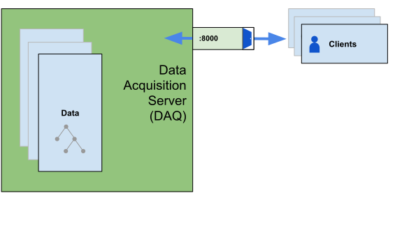
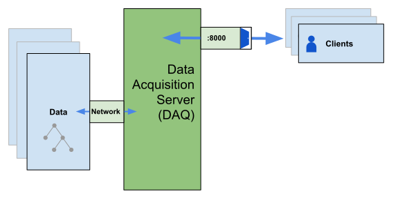

# Tree Design & Configuration

MDSplus stores data as trees. Before you begin your experiment, you should take the time to design your trees to take in the raw data your experiment will generate, plus room for the processed data that your team will create as they analyze the raw data. [TODO: Ask Stephen if we could make a list of what's easy to change and what's hard to change later on]

* Designing your trees
  * raw/processed
* Storing your trees
  * new/archive

## Subtrees

One major decision you will need to make is whether and how to include subtrees in the design of your data trees. Ultimately, subtrees matter most when scaling up an experiment: as the experiment grows, you may want to restrict access of specific areas to certain groups. In a small experiment with no plans for expansion, there is no need to worry about this. However, if you are setting up an experiment with any growth potential you need to set up any subtrees from the beginning&mdash;it will not be easy to move a portion of your tree to a new subtree, as there are no/few tools to help you do so; additionally, it takes significant effort to go back and reorganize data trees later because you will have to retroactively make subtrees and carefully move the data into them.

Subtree Pros
* Subtrees can be opened independently, which speeds up opening time if you only need specific sections.
* Subtrees allow for restricted access by tree (e.g. grant someone write-access to just their specific diagnostic)

Subtree Cons
* Duplicates/multiplies storage needs. It also takes longer to open everything when you open the head node.

```
add node SUBTREE /usage=subtree
```

## Raw/Processed Data

It is highly recommended that archived data consist of two trees:
* The **raw data** tree should contain all data and device information captured during the experiment. When the shot gets archived, the raw data tree can be marked as immutable (`chattr + i`) to prevent it from being acidentally overwritten. 

* The **processed data** tree can contain everything else&mdash;equations, calculated values (e.g., IP), data computed from an analysis script, alias nodes for different digitizer channels (e.g., nickname for a specific temperature probe). The processed data tree can grow as more people run analyses and add to the computed values.

Raw data trees usually exist as subtrees within the processed data trees, allowing the processed tree to contain expressions that reference the raw tree's nodes (note that expressions should only reference children nodes, not parent nodes).


## Storage

Your DAQ server may be configured to store your experimental data locally or on a network location (such as via iSCSI or NFS). 
| DAQ server with local trees &nbsp;&nbsp;&nbsp;&nbsp;&nbsp;&nbsp;&nbsp;&nbsp;&nbsp;&nbsp;&nbsp;&nbsp;&nbsp; | DAQ server + archive server, networked trees |
| --------------------------- | ---------------------------------------------- |
|  |  |

We recommend combining the following two approaches to ensure that the data is safely stored for both short- and long-term needs: 

 * **Fast local storage** receives all of the new data generated by your experiment. Speed is more important than size, although it is a good idea to have enough of this storage for at least a week's worth of operation. You probably won't have too many shots so that it's ok to store all the shots in the same directory, but you can separate them by tree if you prefer. 
  
    For example:
    ```
    ls /trees/new/TREE/
    TREE_YEARMONTHDAY001.tree
    TREE_YEARMONTHDAY001.datafile
    TREE_YEARMONTHDAY001.characteristics
    ```

 * **Archive storage** should provide ample space for the experiment, with plenty of room for expansion. Speed is a secondary concern since you will likely run a regular (at least nightly) backup process from the new data storage into archive. Network Attached Storage (NAS) is suitable for this purpose. There will be too many shots to store in one directory, even one directory per tree&mdash;it is recommended to have a directory for each day and possibly a directory for each tree for each day. 

    For example:
    ```
    ls /trees/archive/YEAR/MONTH/DAY/TREE/
    TREE_YEARMONTHDAY001.tree
    TREE_YEARMONTHDAY001.datafile
    TREE_YEARMONTHDAY001.characteristics
    TREE_YEARMONTHDAY002.tree
    TREE_YEARMONTHDAY002.datafile
    TREE_YEARMONTHDAY002.characteristics
    ```

**Note**: If you already have experience with ZFS, it is well suited for archival storage. One of the major advantages of ZFS is the de-duping, which will considerably reduce the size of your data. However, it is also complicated to set up and requires administration, so it is not recommended for all users.
