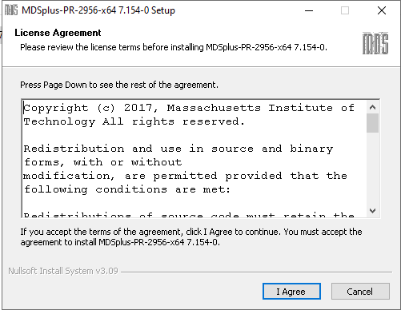
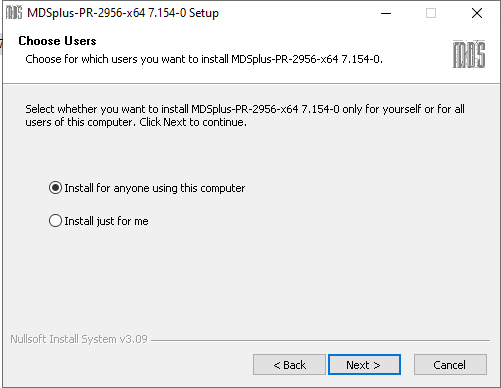
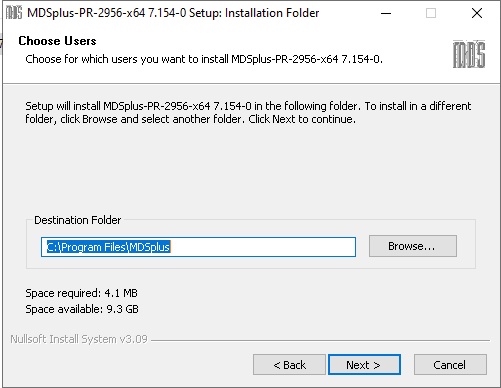
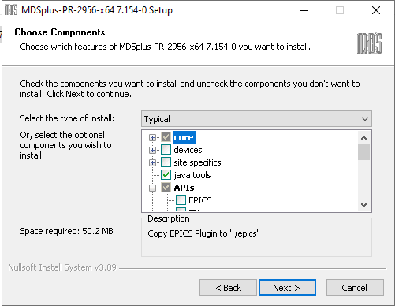
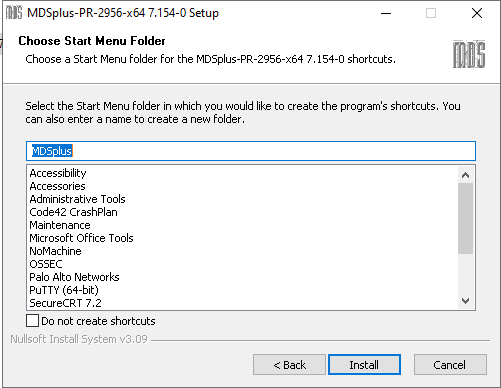
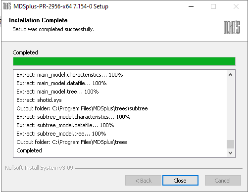
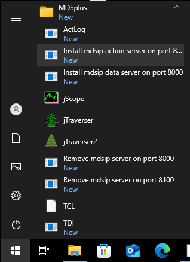
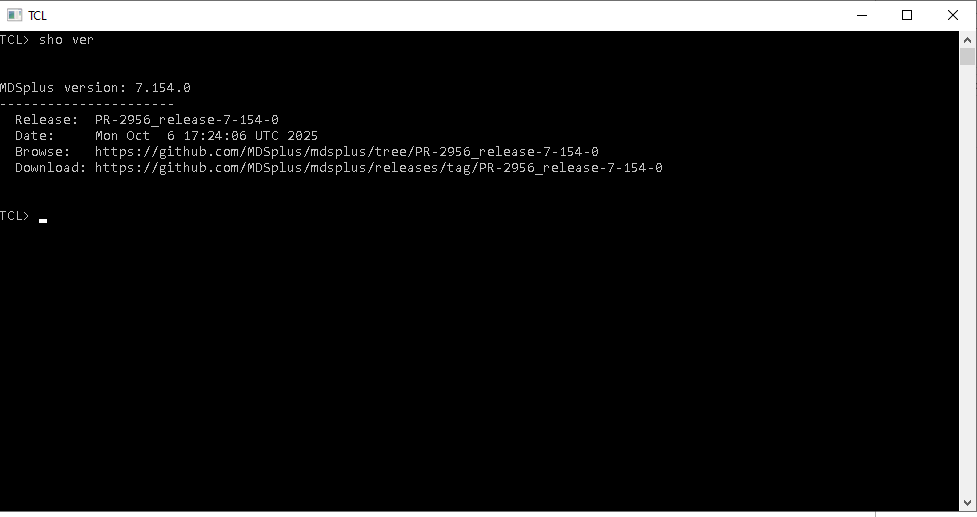
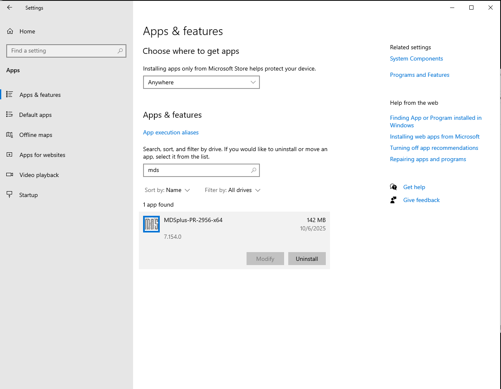

# Windows Installation

To install MDSplus for Windows, first download the appropriate version, and then open the installer (exe) file. Follow the on-screen prompts

1. Read the License Agreement and click "I Agree" to continue
    

2. Choose whether to install MDSplus for all users on the computer or just yourself. Choosing all users will default to the "Program Files" directory; choosing "just for me" will default to your user directory.

    

3. Confirm the installation directory.

    

4. Choose the components you wish to include with your installation.

    

5. Choose the shortcut options for Start menu and other locations

    

6. MDSplus will be installed.

    

7. To confirm installation, it is suggested that you open TCL and use the `show version` command to confirm.

    > TODO: new screenshot of start menu with TCL highlighted

    

    

## Uninstall

To uninstall MDSplus, go to Windows Settings → Apps and uninstall as with any other program.

## Java Applications
MDSplus for Windows no longer includes the Java Run-time Environment in the installation kit. To run the Java applications (jScope and Traverser) provided with the MDSplus installation, you will need to also install either a Java Run-time Environment (JRE) or the Java Development Kit (jdk). These kits can be found on at http://www.oracle.com. Be sure to install either a JRE or a JDK kit found in "Downloads for developers". The download on the Oracle site entitled "Java for your computer" provides only the browser support for Java and is not sufficient to run the Java applications provided with MDSplus.